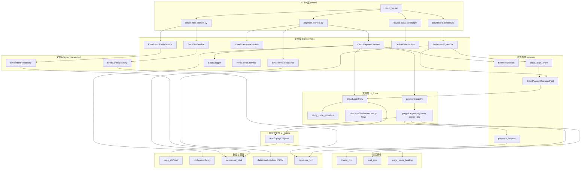
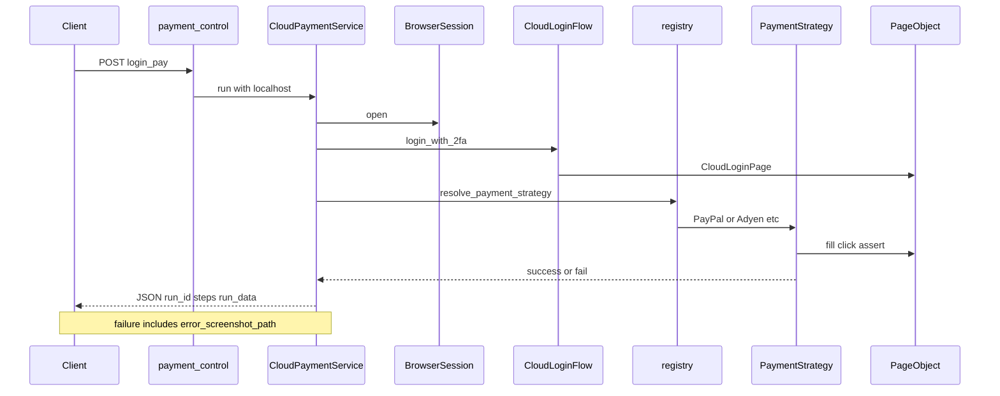
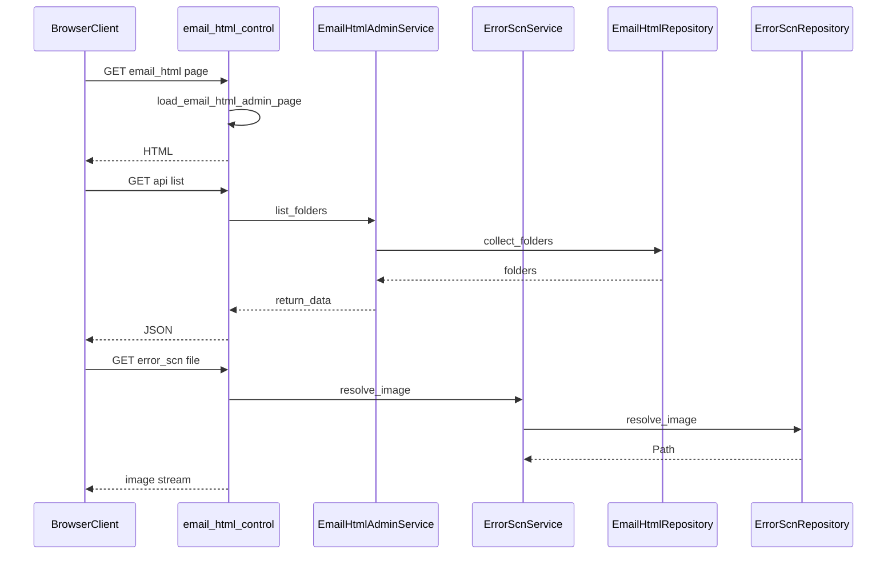

# official_website_server 说明

Reolink 官网 / Cloud 自动化测试服务，基于 **Flask + Playwright**，提供：

- **Cloud 支付 UI 自动化**（PayPal / Adyen / Payoneer / Google Pay）
- **Cloud Dashboard UI 自动化**（订阅列表、自动续费、锁卡套餐、Payment History 等）
- **套餐切换 / 退款计算**、**邮件 HTML 模板校验与管理**
- **设备测试数据**（查询未绑定 UID、解绑、清理 4G/普通设备）

所有业务路由挂载在 `/cloud/` 前缀下。应用入口：`main.py` → `app.register_blueprint(cloud_bp)`，路由注册见 `control/__init__.py`。

---

## 目录

1. [快速开始](#快速开始)
2. [架构总览](#架构总览)
3. [分层设计原则](#分层设计原则)
4. [UI 支付自动化调用链](#ui-支付自动化调用链)
5. [账号浏览器池与登录复用](#账号浏览器池与登录复用)
6. [目录结构](#目录结构)
7. [元素定位 page_ele](#元素定位-page_ele)
8. [关联目录（data / logs）](#关联目录data--logs)
9. [主要 API](#主要-api)
10. [邮件模板管理（模块化）](#邮件模板管理模块化)
11. [配置参考](#配置参考)
12. [统一响应与 steps 结构](#统一响应与-steps-结构)
13. [扩展指南](#扩展指南)
14. [新增 UI 自动化场景：标准步骤](#新增-ui-自动化场景标准步骤)
15. [示例 A / B](#示例-a在-checkout-增加新支付方式apple-pay)
16. [调试与排错](#调试与排错-checklist)
17. [场景选型](#场景选型走哪条链路)

---

## 快速开始

```bash
# 在 official_website_server 目录启动 Flask（默认端口 5007）
python main.py

# 健康检查
curl -X POST http://127.0.0.1:5007/cloud/status

# 邮件模板管理页（浏览器打开）
http://127.0.0.1:5007/cloud/email_html/

# Dashboard 场景示例（body 见 data/cloud/ 或 data/request_payload_exp/ 下 JSON）
curl -X POST http://127.0.0.1:5007/cloud/dashboard/subscription_list \
  -H "Content-Type: application/json" \
  -d @data/request_payload_exp/payload_dashboard_186227.json

# 支付 UI 自动化示例
curl -X POST http://127.0.0.1:5007/cloud/payment/login_pay \
  -H "Content-Type: application/json" \
  -d @data/cloud/payload_xxx.json
```

本地跑 UI 自动化前请确认：

1. `configs/config.py` 中 Chrome 路径（`CLOUD_PAYMENT_EXECUTABLE_PATH`）、代理（`CLOUD_BROWSER_PROXY`）是否与本机一致
2. 测试账号、IMAP 或 `data/temporary_storage/cloud_token_storage.json` 已配置
3. 需要看浏览器时将 `CLOUD_PAYMENT_HEADLESS = False`
4. Dashboard 等多步场景依赖 **账号浏览器池**（见下文），同一账号请求会自动串行、不同账号可并行

---

## 架构总览



---

## 分层设计原则

模块按 **Control → Service → Browser / Flow / Repository** 分层：

| 层 | 目录 | 职责 | 禁止 |
|----|------|------|------|
| **Control** | `control/` | 解析 HTTP 请求、注入 `localhost`、``jsonify`` / ``send_file`` | 业务逻辑、文件读写、Playwright 操作 |
| **Service** | `services/` | 编排流程、校验参数、组装 `return_data` | 直接操作 DOM、硬编码选择器 |
| **Repository** | `services/email/` | 邮件模板 / 失败截图路径解析与文件 CRUD | HTTP 感知、Flask 依赖 |
| **Browser** | `browser/` | Playwright 会话、账号浏览器池、失败截图 | 支付/登录业务流程 |
| **Flow** | `ui_flows/` | 多步 UI 编排（登录、Setup、支付策略、Dashboard） | 裸选择器字符串 |
| **Page Object** | `ui_pages/` | 单页元素操作，读 `page_ele/` YAML | 跨页业务流程 |
| **元素定位** | `page_ele/` | 选择器、超时、默认测试数据 YAML | Python 逻辑、HTTP |
| **Operations** | `ui_pages/common/` + `ui_flows/payment/` | 等待/刷新；PayPal iframe 编排 | 业务断言 |
| **Web** | `web/email_web/` | 静态管理页 HTML | Python 逻辑 |

**主要业务链路对照：**

| 能力 | Control | Service | 底层 |
|------|---------|---------|------|
| Cloud checkout 支付 UI | `payment_control` | `services/payment/cloud_payment_service` | `BrowserSession` + Strategy |
| Dashboard / 锁卡 / 自动续费 UI | `dashboard_control` | `services/dashboard/*` | `run_cloud_ui` + 账号池 + Flow |
| 邮件模板 CRUD / 截图浏览 | `email_html_control` | `services/email/*` | `EmailHtmlRepository` / `ErrorScnRepository` |
| 邮件渲染校验（无 UI） | `payment_control.check_email` | `services/email/email_template_service` | 读 `data/email_html/` |
| 设备 uid/suid 查询（无 UI） | `device_data_control` | `services/common/device_data_service` | `utils/api/common.CloudDbUtils` |
| 设备解绑 / 清理（无 UI） | `device_data_control` | `services/common/device_data_service` | `utils/api/cloud_api_utils` |

> `EmailTemplateService`（``check_email``）与 `EmailHtmlAdminService`（Web 管理 CRUD）**职责不同、勿合并**：前者在 `services/email/email_template_service.py` 按业务参数渲染；后者面向运维/测试的文件管理界面。

---

## UI 支付自动化调用链



---

## 账号浏览器池与登录复用

Dashboard、自动续费等 **多步 UI 场景** 不每次新建浏览器，而是通过账号维度浏览器池复用登录态：

| 模块 | 作用 |
|------|------|
| `browser/account_browser_pool.py` | `CloudAccountBrowserPool`：一账号一线程 + 一 Browser + 一 Context；同账号串行、不同账号并行 |
| `browser/cloud_login_entry.py` | `run_cloud_ui()` 按 account 派发到对应 worker；`acquire_browser()` 获取 `work_page` |
| `browser/google_pay_storage.py` | Google Pay 专用 `storage_state` 持久化 |
| `services/dashboard/cloud_ui_service_base.py` | Dashboard Service 共用基类（`run_id` / `steps` / 成功失败响应） |

**Control 典型写法**（见 `dashboard_control._run_ui`）：

```python
from browser.cloud_login_entry import run_cloud_ui

def _run_ui(service_cls):
    args = request.get_json() or {}
    args["localhost"] = request.host_url
    return run_cloud_ui(lambda: service_cls(args).run(), args=args)
```

**Service 典型写法**：继承 `CloudUiServiceBase`，在 `run()` 内用 `acquire_browser(args, self.steps_logger)` 获取已登录的 `work_page`，再调用对应 Flow。

**checkout 一次性支付**（`payment/login_pay`）仍使用 `BrowserSession().open()` 独立会话，不走账号池。

请求体可通过 `bypass_login_pool=true` 跳过池（调试 / 特殊场景）。

---

## 目录结构

```
official_website_server/
├── main.py                  # Flask 入口（默认 0.0.0.0:5007）
├── control/                 # Flask 路由（薄层，只做参数转发）
│   ├── __init__.py          # cloud_bp 路由注册
│   ├── payment_control.py   # 支付 / 计算 / check_email
│   ├── dashboard_control.py # Dashboard / 自动续费 / 锁卡 UI
│   ├── device_data_control.py
│   └── email_html_control.py
├── services/
│   ├── dashboard/           # Dashboard UI 场景（继承 cloud_ui_service_base）
│   ├── payment/             # checkout 支付、Google Pay 探测、套餐计算器
│   ├── email/               # 邮件模板 Service + Repository + error_scn
│   └── common/              # steps_logger、device_data、verify_code、token_resolve
├── browser/                 # Playwright 会话、账号池、登录入口、截图
│   ├── session.py
│   ├── account_browser_pool.py
│   ├── cloud_login_entry.py
│   ├── payment_helpers.py
│   └── google_pay_storage.py
├── ui_flows/
│   ├── common/
│   │   ├── login/
│   │   ├── checkout/        # 购买 Setup
│   │   ├── dashboard/
│   │   ├── lock_card/
│   │   └── payment_history/
│   └── payment/             # registry + strategies + iframe_ops
├── ui_pages/
│   ├── front/               # login / home / checkout / dashboard / lock_card / payment_history
│   └── common/wait_ops.py
├── page_ele/
│   ├── front/
│   └── ui_healing/
├── utils/
│   ├── api/                 # 业务 API / DB / 校验 / XXL-JOB
│   └── response.py / path_extra.py / logger.py 等
├── web/email_web/
├── configs/                 # config.py 及 cloud_*_config.py 分模块配置
├── data/
│   ├── email_html/
│   ├── cloud/               # 禅道用例 payload、debug_cache
│   ├── request_payload_exp/
│   └── temporary_storage/
├── scripts/                 # try_unbind、generate_warm_output
├── docs/
├── logs/run_logs/ + logs/error_scn/
└── Readme.md
```

导包约定示例：

- `from control import cloud_bp`
- `from browser.cloud_login_entry import run_cloud_ui, acquire_browser`
- `from services.dashboard.cloud_ui_service_base import CloudUiServiceBase`
- `from services.payment.cloud_payment_service import CloudPaymentService`
- `from services.email.email_html_admin_service import EmailHtmlAdminService`
- `from utils.api.cloud_api_utils import CloudApiUtils`
- `from page_ele.ui_healing.cloud_base_page import CloudBasePage`
- `from web.email_web import load_email_html_admin_page`
- `from ui_pages.common.wait_ops import reload_checkout_and_continue`
- `from ui_flows.payment.iframe_ops import prepare_paypal_iframe`

### `control/` — HTTP 入口

| 文件 | 作用 |
|------|------|
| `__init__.py` | 定义 `cloud_bp`，注册全部 `/cloud/*` 路由 |
| `payment_control.py` | 支付自动化、Google Pay 探测、套餐计算、邮件校验 |
| `dashboard_control.py` | Dashboard / 自动续费 / 锁卡 / Payment History UI |
| `device_data_control.py` | 设备查询、解绑、4G/普通设备清理 |
| `email_html_control.py` | 邮件模板管理（委托 `services/email/`） |

### `services/` — 业务层

| 子目录 / 文件 | 作用 |
|---------------|------|
| `dashboard/` | Dashboard UI 场景，继承 `cloud_ui_service_base.py` |
| `dashboard/cloud_dashboard_service.py` | 云套餐订阅列表验证 |
| `dashboard/cloud_dashboard_*_auto_renew_service.py` | PayPal / Adyen / SIM 自动续费 |
| `dashboard/cloud_dashboard_traffic_service.py` | 流量套餐 table（支持未登录） |
| `dashboard/cloud_dashboard_lock_card_plan_*.py` | 锁卡购买 / 切换 |
| `dashboard/cloud_dashboard_payment_history_service.py` | Payment History / Invoice |
| `payment/cloud_payment_service.py` | checkout 支付（BrowserSession → 登录 → Strategy） |
| `payment/cloud_calculator.py` | 云套餐切换/退款、流量有效期扣减 |
| `payment/cloud_google_pay_*_service.py` | Google Pay 国家 / 金额 UI 探测 |
| `email/*` | 邮件 CRUD、check_email、Repository、error_scn |
| `common/steps_logger.py` | 步骤日志 |
| `common/verify_code_service.py` | Cloud 2FA 验证码 |
| `common/device_data_service.py` | 设备 uid 查询、解绑、清理 |
| `common/ui_fail_response.py` | UI 失败响应与截图 URL |

### `browser/` — 浏览器生命周期

| 文件 | 作用 |
|------|------|
| `session.py` | `BrowserSession`：`sync_playwright` 封装 |
| `account_browser_pool.py` | 账号维度浏览器池 |
| `cloud_login_entry.py` | `run_cloud_ui` / `acquire_browser` |
| `payment_helpers.py` | 失败截图、token 持久化、`safe_close_browser` |
| `google_pay_storage.py` | Google Pay storage_state 读写 |

### `ui_flows/` — 流程编排

| 路径 | 作用 |
|------|------|
| `common/login/cloud_login_flow.py` | Cloud 登录 + 2FA |
| `common/login/verify_code_providers.py` | IMAP / 后台 API 取码 |
| `common/checkout/` | 购买 Setup（云套餐 / 流量 / 免费曝光 / 签约） |
| `common/dashboard/` | 订阅列表、自动续费、SIM、流量 Flow |
| `common/lock_card/` | 锁卡绑定 / 购买 / 切换 |
| `common/payment_history/` | 支付历史、自动续费订单 |
| `payment/registry.py` + `strategies/` | 支付策略分发 |
| `payment/iframe_ops.py` | PayPal iframe 编排 |

### `page_ele/` — 元素定位 YAML

| 路径 | 作用 |
|------|------|
| `front/login/` | 登录 / 2FA |
| `front/checkout/` | checkout 支付页（PayPal / Adyen / Payoneer / Google Pay） |
| `front/dashboard/` | Dashboard、云套餐、SIM、流量 |
| `front/lock_card/` | 锁卡套餐 |
| `front/payment_history/` | 支付历史、Invoice |
| `ui_healing/` | LLM 元素自愈 |

```python
from page_ele import load_page_yaml
_pd = load_page_yaml("front", "checkout", "cloud_adyen_page.yml")
```

> 历史根目录 `page_ele/front/cloud_*.yml` 与 `front/<域>/` 并存；新增请放在 `front/<域>/`。

### `ui_pages/front/` — Page Object

域目录：`login` / `home` / `checkout` / `dashboard` / `lock_card` / `payment_history`。

| 域 | 典型文件 | YAML |
|----|----------|------|
| `checkout/` | `cloud_checkout_pay_page.py` 等 | `front/checkout/cloud_*_page.yml` |
| `dashboard/` | `cloud_dashboard_page.py` 等 | `front/dashboard/cloud_*_page.yml` |
| `login/` | `cloud_login_page.py` | `front/login/login_signup_page.yml` |

选择器维护原则：**改 UI 优先改 `page_ele/` YAML**；Page Object 只封装操作。

---

## 元素定位（page_ele）

Cloud 模块的 Playwright 选择器、超时、默认测试数据统一放在 **`page_ele/`**，与 `ui_pages/`、`ui_flows/` 同属 Cloud 包，便于版本管理与代码审查。

### 目录结构

```
page_ele/
├── __init__.py              # page_ele_path / load_page_yaml
├── front/                   # 前台 Cloud 页（按业务域，与 ui_pages/front 一一对应）
│   ├── login/login_signup_page.yml
│   ├── home/cloud_home_page.yml
│   ├── checkout/            # checkout 支付页 YAML
│   ├── dashboard/           # dashboard / cloud_plan / sim_card / traffic
│   ├── lock_card/cloud_lock_card_plan_page.yml
│   └── payment_history/     # payment_history / invoice / my_payment
├── dashboard.yml            # 预留
└── payment_history.yml      # 预留
```

### 元素 YAML 位置

| 模块 | 元素 YAML 位置 | 加载方式 |
|------|----------------|----------|
| **Cloud** | `page_ele/` | `load_page_yaml("front", "<域>", "xxx.yml")` |
| **Cloud** | `page_ele/` | `rel("page_ele/...")` |

Cloud 使用基于模块目录的 `page_ele_path()`，不依赖项目根下的 `data/`，避免业务代码与数据目录混杂。

### 新增页面 YAML  checklist

1. 在 `page_ele/front/<域>/` 新建 `cloud_xxx_page.yml`（域：`login` / `home` / `checkout` / `dashboard` / `lock_card` / `payment_history`）
2. 在 `ui_pages/front/<域>/` 新建对应 Page Object，顶部 `load_page_yaml("front", "<域>", ...)`
3. 超时、重试次数、默认卡号等**配置型字段**放 YAML，不放 Python 常量（支付凭证除外可从请求体覆盖）
4. iframe 内元素在 Page Object 内用 `frame_locator` 封装，YAML 存 iframe 与子选择器键名

---

### 横切 UI 操作

| 路径 | 作用 |
|------|------|
| `ui_flows/payment/iframe_ops.py` | PayPal smart iframe 等待与 `switch_to_frame` |
| `ui_pages/common/wait_ops.py` | checkout 刷新；选择器可见重试 |

### `utils/` — 工具

| 路径 | 作用 |
|------|------|
| `response.py` | 统一 API 响应 `return_data()` |
| `read_data.py` | 加载 YAML / JSON / INI |
| `path_extra.py` / `path_safe.py` | 相对路径 `rel()`、目录穿越防护 |
| `logger.py` | 日志（`logs/run_logs/`） |
| `api/common.py` | review MySQL（`CloudDbUtils`） |
| `api/cloud_api_utils.py` | Cloud OpenAPI（登录、解绑） |
| `api/count_price.py` | 价格计算 |
| `api/xxl_job_utils.py` | XXL-JOB 自动续费任务触发 |
| `api/*_validator.py` | 各 Dashboard 场景 API 断言校验 |

---

## 关联目录（data / logs）

| 路径 | 作用 |
|------|------|
| `configs/config.py` | 统一配置入口（浏览器、OpenAPI、MySQL、自愈、XXL-JOB） |
| `configs/cloud_*_config.py` | 分模块配置（可被 `config.py` 引用或单独维护） |
| `data/email_html/` | 邮件 HTML 模板与 `{subject}.json` parms |
| `data/cloud/` | 禅道用例 payload JSON、Setup 缓存（`debug_cache/`）、回归输出 |
| `data/request_payload_exp/` | Dashboard 等场景的请求体示例 |
| `data/temporary_storage/` | `cloud_token_storage.json`（MailProxy admin token）、`ui_login_storage.json` |
| `logs/error_scn/` | UI 失败截图（`date_MMDD/` 子目录） |
| `logs/run_logs/` | 按日期的运行日志 |

---

## 主要 API

完整路由清单见 `control/__init__.py` 模块 docstring。

### 支付与计算

| 方法 | 路径 | 说明 |
|------|------|------|
| POST | `/cloud/status` | 服务健康检查 |
| POST | `/cloud/payment/login_pay` | Cloud 登录 + checkout 支付 UI 自动化 |
| POST | `/cloud/payment/google_pay_country` | Google Pay 国家/币种 UI 探测 |
| POST | `/cloud/payment/google_pay_amount` | Google Pay 金额 UI 探测 |
| POST | `/cloud/calculate_utils_cloud` | 云套餐切换/退款金额计算 |
| POST | `/cloud/calculate_utils_traffic` | 流量套餐退款后有效期计算 |
| POST | `/cloud/check_email` | 邮件模板变量校验与 HTML 渲染 |

### Dashboard UI 自动化

| 方法 | 路径 | 说明 |
|------|------|------|
| POST | `/cloud/dashboard/subscription_list` | 云套餐订阅列表验证 |
| POST | `/cloud/dashboard/payment_history_invoice` | Payment History / Invoice |
| POST | `/cloud/dashboard/traffic_table` | 流量套餐 table（可未登录） |
| POST | `/cloud/dashboard/sim_auto_renew` | SIM 自动续费（已废弃，见 control 注释） |
| POST | `/cloud/dashboard/paypal_auto_renew` | PayPal 云套餐自动续费 |
| POST | `/cloud/dashboard/adyen_auto_renew` | Adyen 云套餐自动续费 |
| POST | `/cloud/dashboard/adyen_auto_renew_grouping` | Adyen 多订阅分组扣费 |
| POST | `/cloud/dashboard/lock_card_plan_purchase` | 4G 锁卡套餐购买页 |
| POST | `/cloud/dashboard/lock_card_plan_switch` | 4G 锁卡套餐切换页 |
| POST | `/cloud/dashboard/auto_renew_payment_order` | 自动续费扣费订单 |
| POST | `/cloud/dashboard/sim_card_info` | SIM 卡信息页 |
| POST | `/cloud/dashboard/auto_renew_toggle` | 自动续费开关切换 |

Dashboard 请求体通常含 `account` / `passwd` / `email_account` 等登录字段，以及 `setup` / `steps` 等业务参数；示例见 `data/cloud/`、`data/request_payload_exp/`。

### 设备测试数据

| 方法 | 路径 | 说明 |
|------|------|------|
| POST | `/cloud/device/unbound_uid_suid` | 查询未绑定设备的 uid / suid（review MySQL） |
| POST | `/cloud/device/unbind` | 按 uid 列表逐个解绑（`DELETE /v2/devices/{uid}`） |
| POST | `/cloud/device/clean_4g` | 清理 4G 设备测试数据 |
| POST | `/cloud/device/clean_normal` | 清理普通设备测试数据 |

### 邮件模板管理

| 方法 | 路径 | 说明 |
|------|------|------|
| GET | `/cloud/email_html/` | 管理页面 |
| GET/POST/PUT/DELETE | `/cloud/email_html/api/*` | 模板 list / read / upload / 编辑 / 删除 |
| GET | `/cloud/email_html/error_scn/list` | 失败截图列表 |
| GET | `/cloud/email_html/error_scn/file?name=` | 查看单张截图 |

---

## 邮件模板管理（模块化）

### 调用链



路径安全由 `utils/path_safe.py` 统一处理（子路径规范化、禁止 `..` 目录穿越），Repository 层调用 `safe_dir_under` / `ensure_under_base`。

### 模板文件目录结构

模板存放在 `data/email_html/`，与 ``check_email`` 的路径规则一致：

```
data/email_html/
└── {environment}/              # 如 reolink cloud、uniden
    └── {productType}/          # cloud_storage_plan | cloud_storage_data_plan | cloud_data_plan
        ├── is_free/            # isFree=1
        │   ├── {subject}.html
        │   └── {subject}.json  # parms，结构与请求 data 对齐
        └── not_free/           # isFree=0
            ├── {subject}.html
            └── {subject}.json
```

上传 API 的 `subpath` 即上述相对路径（如 `reolink cloud/cloud_storage_plan/is_free`），不含 `data/email_html` 前缀。

### 邮件 HTML 管理 API 明细

| 方法 | 路径 | 参数 | 说明 |
|------|------|------|------|
| GET | `/cloud/email_html/` | — | 返回 Web 管理页（`web/email_web/email_html_admin.html`） |
| GET | `.../api/list` | — | 扫描全部子目录，返回 `{ base, folders: [{ subpath, json_files, html_files }] }` |
| GET | `.../api/read` | `subpath`, `name` | 读取单个 `.json` 或 `.html` 内容 |
| POST | `.../api/upload` | `multipart`: `subpath`, `html_file`, `json_file` | HTML 文件名决定 stem；JSON 保存为 `{stem}.json` |
| PUT | `.../api/json` | JSON body: `{ subpath, name, json }` | 覆盖写入 parms.json |
| PUT | `.../api/html` | JSON body: `{ subpath, name, html }` | 覆盖写入 HTML |
| DELETE | `.../api/file` | `subpath`, `name` | 仅允许删除 `.html` / `.json` |
| GET | `.../error_scn/list` | — | 按 `date_MMDD/` 分组列出截图 |
| GET | `.../error_scn/file` | `name` | 相对 `logs/error_scn/` 的路径，如 `date_0629/xxx.png` |

**upload 示例（curl）：**

```bash
curl -X POST "http://127.0.0.1:5007/cloud/email_html/api/upload" \
  -F "subpath=reolink cloud/cloud_storage_plan/is_free" \
  -F "html_file=@Thanks for Subscribing to Reolink.html" \
  -F "json_file=@parms.json"
```

**read 示例：**

```bash
GET /cloud/email_html/api/read?subpath=reolink%20cloud/cloud_storage_plan/not_free&name=Thanks%20for%20Subscribing%20to%20Reolink.json
```

### error_scn 截图约定

| 项 | 说明 |
|----|------|
| 存储根目录 | `official_website_server/logs/error_scn/` |
| 子目录 | `date_MMDD/`（按截图当天月日） |
| 文件命名 | `cloud_pay_{tag}_{timestamp}_p{idx}.png` |
| 多 Tab | 同一 context 下每个 Page 各截一张，`p0`、`p1`… |
| HTTP 访问 | 支付失败响应中的 URL 指向 `/cloud/email_html/error_scn/file?name=` |
| 写入方 | `browser/payment_helpers.cloud_pay_error_screenshot()` |

---

## `/cloud/payment/login_pay` 请求与响应

### 请求参数

| 字段 | 必填 | 说明 |
|------|------|------|
| `pay_url` | 是 | Cloud checkout 完整 URL |
| `account` | 是 | Cloud 登录邮箱 |
| `passwd` | 是 | Cloud 登录密码 |
| `email_account` | 是 | 收验证码的邮箱（IMAP 或后台查询账号） |
| `email_passwd` | 是* | IMAP 密码；`get_code_type` 非空时可忽略 |
| `pay_type` | 否 | 默认 `paypal`；见下方策略匹配表 |
| `get_code_type` | 否 | 非空时走后台 MailProxy 取码；空则 IMAP |
| `cloud_login_url` | 否 | 覆盖默认 `CLOUD_LOGIN_URL` |
| `paypal_email` / `paypal_passwd` | 否 | PayPal 策略可选 |
| `google_pay` | Google Pay 推荐 | `{email, password?, cardName?, cardLastNumber?}`；也可用顶层 `email`（Gmail）兼容 |
| Adyen / Payoneer 相关字段 | 否 | 见各 Strategy 的 `from_args` 与 YAML 默认值 |

### 支付策略匹配（`registry.resolve_payment_strategy`）

| `pay_type` 条件 | Strategy | 说明 |
|-----------------|----------|------|
| 完全等于 `paypal` | `PayPalStrategy` | iframe + 弹窗 fallback |
| 含 `adyen` | `AdyenStrategy` | variant=`adyen` |
| 含 `CB` | `AdyenStrategy` | variant=`cb` |
| 含 `payonerr` | `PayoneerStrategy` | 历史拼写保留 |
| 含 `google pay` | `GooglePayStrategy` | 大小写不敏感（子串匹配） |
| 其他 | `None` | 返回 `not_pay` 失败 |

匹配顺序与重构前 `cloud_pay_with_login` 分支一致；新增支付方式在 `registry.py` **末尾**追加判断即可。

### 请求体（节选）

```json
{
  "pay_url": "https://cloud.reolink.review/...",
  "account": "user@example.com",
  "passwd": "***",
  "email_account": "imap@example.com",
  "email_passwd": "***",
  "pay_type": "paypal",
  "get_code_type": "",
  "paypal_email": "可选",
  "paypal_passwd": "可选"
}
```

`pay_type` 支持：`paypal`、含 `adyen`、含 `CB`、含 `payonerr`、含 `google pay`。

### 成功响应

```json
{
  "code": 200,
  "success": true,
  "data": {
    "run_id": "uuid",
    "steps": [{ "step": "...", "success": true, "timestamp": "..." }],
    "run_data": { "paypal_pay": "success" }
  }
}
```

### 失败响应

失败步骤的 `steps` 条目及 `data` 顶层均包含：

- `error_screenshot_path` — 首张截图 URL
- `error_screenshot_paths` — 全部截图 URL（多 Tab 时有多张）
- `error_screenshot_rel_paths` — `logs/error_scn/` 下相对路径

截图 URL 格式：`{host}/cloud/email_html/error_scn/file?name=date_MMDD/xxx.png`

---

## `/cloud/check_email` 请求与响应

按 ``environment`` + ``productType`` + ``isFree`` + ``subject`` 定位模板，校验请求 ``data`` 是否覆盖 parms.json 全部键，并在内存中替换 HTML 占位符（**不写回文件**）。

### 请求参数

| 字段 | 必填 | 说明 |
|------|------|------|
| `environment` | 是 | `reolink cloud` \| `uniden` |
| `subject` | 是 | 模板文件名（不含扩展名），不可含 `/` `\` |
| `productType` | 是 | `cloud_storage_data_plan` \| `cloud_storage_plan` \| `cloud_data_plan` |
| `isFree` | 否 | `0` 付费 / `1` 免费，默认 `1` |
| `data` | 是 | 渲染数据；若含嵌套 `data` 对象则以其为 payload |

### 成功响应 `data` 字段

| 字段 | 说明 |
|------|------|
| `email_html` | 占位符替换后的 HTML 字符串 |
| `parms` | 对应 `{subject}.json` 内容 |
| `environment` / `subject` / `productType` / `isFree` | 回显请求参数 |

校验失败时返回 `missing_keys` 列表（parms 中有而 data 中缺的点分路径）。

---

## `/cloud/calculate_utils_cloud` 与 `calculate_utils_traffic`

### 云套餐切换 / 退款（`calculate_utils_cloud`）

| 字段 | 说明 |
|------|------|
| `now_time` | 当前时间戳（毫秒） |
| `option` | `1` = 切换套餐（算新结束时间）；`0` = 退款（算剩余含税金额） |
| `zhouqi` / `new_zhouqi` | 旧/新周期：`0` 月、`1` 年 |
| `cloud_all_money` / `cloud_all_money_with_tax` | 订阅金额（不含税 / 含税） |
| `cloud_all_credit` / `new_month_credit` | 旧/新套餐 coin 额度 |
| `new_month_money` | 新套餐月价 |
| `time_cost` | 已消耗小时数（周期内） |
| `period_start_ms` | 可选；距周期开始 < 3h 时强制 `time_cost=0` |

**`option=1` 成功：** `{ timestamp, end_time }` — 切换后结束时间。  
**`option=0` 成功：** `{ left_money }` — 剩余可退含税金额。

### 流量套餐有效期扣减（`calculate_utils_traffic`）

| 字段 | 说明 |
|------|------|
| `start_at` / `end_at` | 订阅起止时间戳（毫秒） |
| `cloud_all_money_with_tax` | 含税订阅总额（分母） |
| `refund_money` | 本次退款金额 |

按退款占含税总额比例折算应扣天数，返回新的 `{ timestamp, end_time }`（UTC）。

---

## `/cloud/device/unbound_uid_suid`

从 review 环境 MySQL 查询**未绑定账号**、**未锁卡**、UID 前缀为 `952700Y` 的设备，按 `id` 倒序取一条。

### 请求参数

| 字段 | 必填 | 说明 |
|------|------|------|
| `offset` | 否 | 分页偏移，默认 `100`（对应 SQL `LIMIT 1 OFFSET n`） |

### 成功响应 `data`

| 字段 | 说明 |
|------|------|
| `uid` | 设备 UID |
| `suid` | 设备 SUID |
| `offset` | 实际使用的偏移量 |

### 请求示例

```bash
curl -X POST http://127.0.0.1:5007/cloud/device/unbound_uid_suid \
  -H "Content-Type: application/json" \
  -d '{"offset": 100}'
```

### 成功响应示例

```json
{
  "code": 200,
  "success": true,
  "message": "ok",
  "data": {
    "uid": "952700Yxxxxxxxx",
    "suid": "xxxxxxxx",
    "offset": 100
  }
}
```

无匹配记录时返回 `404`，`message` 为 `no device found`。

数据库连接见 `configs/config.py`（默认 host `192.168.2.94`，库 `review_us_services_devices`）。

---

## `/cloud/device/unbind`

调用 `DELETE https://apis.reolink.review/v2/devices/{uid}`，**无请求体**，按传入 uid 列表**顺序逐个**解绑。

### 请求参数

| 字段 | 必填 | 说明 |
|------|------|------|
| `uids` | 是* | 待解绑设备 UID 列表，如 `["952700Y006U41ICZ", "952700Y007A3HDFP"]` |
| `uid` | 是* | 单个 UID（与 `uids` 二选一） |
| `access_token` | 否* | 已登录用户的 Bearer token |
| `account` | 否* | Cloud 登录邮箱（与 `access_token` 二选一） |
| `passwd` / `password` | 否* | 登录密码 |
| `mfa_trust_token` | 否* | MFA 信任 token（`REO_MFA_TRUST_TOKEN`） |

\* 认证：`access_token` 与 `(account, passwd, mfa_trust_token)` 二选一；设备：`uids` 与 `uid` 二选一。

### 成功响应 `data`

| 字段 | 说明 |
|------|------|
| `results` | 每台设备的解绑结果列表 |
| `results[].uid` | 设备 UID |
| `results[].status_code` | HTTP 状态码 |
| `results[].success` | 是否 2xx |
| `results[].body` | 响应体（JSON 或文本） |
| `success_count` / `fail_count` / `total` | 汇总 |

全部成功时 `code=200`；部分失败时 `code=207`，`success=false`。

### 请求示例

```bash
curl -X POST http://127.0.0.1:5007/cloud/device/unbind \
  -H "Content-Type: application/json" \
  -d '{
    "uids": ["952700Y006U41ICZ", "952700Y007A3HDFP"],
    "account": "user@example.com",
    "passwd": "***",
    "mfa_trust_token": "***"
  }'
```

或使用已有 token：

```bash
curl -X POST http://127.0.0.1:5007/cloud/device/unbind \
  -H "Content-Type: application/json" \
  -d '{
    "uids": ["952700Y006U41ICZ"],
    "access_token": "eyJ..."
  }'
```

OpenAPI 地址见 `configs/config.py`（默认 `https://apis.reolink.review`）。

---

## 配置参考

统一配置文件 [`configs/config.py`](configs/config.py)：

### Cloud UI / 浏览器

| 配置项 | 默认值 / 说明 |
|--------|----------------|
| `CLOUD_LOGIN_URL` | Cloud 登录入口 |
| `CLOUD_PAY_LOGIN_COOKIES` | 打开页面前注入的 cookie 列表 |
| `CLOUD_PAYMENT_HEADLESS` | `False` — 本地调试建议保持可见窗口 |
| `CLOUD_PAYMENT_EXECUTABLE_PATH` | 系统 Chrome 路径；`None` 则用 Playwright Chromium |
| `CLOUD_BROWSER_CONTEXT_OPTIONS` | viewport / locale |
| `CLOUD_BROWSER_SLOW_MO` | 操作间隔（ms） |
| `CLOUD_BROWSER_PROXY` | 代理；不需要时设为 `None` |
| `CLOUD_POOL_CDP_PORT` | 账号浏览器池 CDP 调试端口（默认 `9333`） |
| `CLOUD_POOL_CHROMIUM_ARGS` | 浏览器池 Chromium 启动参数 |
| `CLOUD_DEFAULT_TIMEOUT_MS` | 默认元素超时 |
| `CLOUD_NAVIGATION_TIMEOUT_MS` | 导航超时 |
| `CLOUD_LOGIN_RATE_LIMIT_WAIT_S` | Send Code 频率限制后等待秒数 |
| `CLOUD_CHECKOUT_PAGE_OPEN_WAIT_S` | 打开 checkout 前 sleep |

验证码后台取码依赖 `data/temporary_storage/cloud_token_storage.json` 中的 admin token（`services/common/verify_code_service`）。

### MySQL（`CLOUD_DB_*`）

| 配置项 | 说明 |
|--------|------|
| `host` | MySQL 主机，默认 `192.168.2.94` |
| `user` / `password` | 数据库账号 |
| `database` | devices / simcard / subscriptions 分库 |
| `charset` | 默认 `utf8mb4` |

### OpenAPI

| 配置项 | 说明 |
|--------|------|
| `CLOUD_API_ROOT` | OpenAPI 根地址，默认 `https://apis.reolink.review` |
| `CLOUD_API_ORIGIN` / `CLOUD_API_REFERER` | 登录与解绑请求头 |
| `CLOUD_TOKEN_CLIENT_ID` | OAuth client_id |

### 自愈 / XXL-JOB

| 配置项 | 说明 |
|--------|------|
| `HEALING_*` | UI 元素自愈开关与限额（环境变量可覆盖） |
| `XXL_JOB_*` | 自动续费定时任务触发 |

---

## 统一响应与 steps 结构

### `return_data()`  envelope

所有 JSON API 共用结构（`utils/response.py`）：

```json
{
  "code": 200,
  "success": true,
  "message": "ok",
  "data": { }
}
```

HTTP 状态码与 `code` 字段一致（400/404/500 等）。

### `steps[]` 单步结构（UI 自动化）

由 `StepsLogger` 写入，支付成功/失败均返回：

```json
{
  "step": "Cloud 登录与 2FA",
  "level": "info",
  "success": true,
  "timestamp": "2026-06-29 12:00:00.123"
}
```

失败时最后一步 `success: false`，并可含：

| 字段 | 说明 |
|------|------|
| `error_screenshot_path` | 首张截图完整 URL |
| `error_screenshot_paths` | 全部截图 URL |
| `error_screenshot_rel_paths` | `logs/error_scn/` 下相对路径 |

`StepsLogger` 规则：每记录新步骤时，将**上一步**标为 `success: true`；流程结束调用 `complete_last_step()` 或失败时 `fail_current_step()`。

---

## 扩展指南

### 新增支付方式

1. 在 `page_ele/front/checkout/` 增加 YAML（或在现有 YAML 中扩展）
2. 新增 `ui_pages/front/checkout/cloud_xxx_page.py`（使用 `load_page_yaml("front", "checkout", ...)`）
3. 实现 `ui_flows/payment/strategies/xxx.py`（继承 `PaymentStrategy`）
4. 在 `ui_flows/payment/registry.py` 注册 `pay_type` 匹配规则

### 修改登录流程

- 页面元素：`page_ele/front/login/login_signup_page.yml` + `ui_pages/front/login/cloud_login_page.py`
- 流程步骤：`ui_flows/common/login/cloud_login_flow.py`
- 验证码来源：`ui_flows/common/login/verify_code_providers.py`

---

## 新增 UI 自动化场景：标准步骤

无论是 **checkout 新支付方式**，还是 **Cloud 内全新业务页**（如绑设备、取消订阅），都建议按下面顺序做，避免选择器散落在 Service / Control 里。


| 步骤 | 做什么 | 产出物 |
|------|--------|--------|
| **1. 需求对齐** | 明确入口 URL、前置登录、关键步骤、成功/失败断言、测试账号与凭证 | 步骤清单（可写进 Strategy 的 `self.log()` 文案） |
| **2. YAML 先行** | 用 DevTools 录选择器，超时/重试/默认测试数据放 YAML | `page_ele/front/<域>/xxx_page.yml` |
| **3. Page Object** | 每个用户可见动作一个方法；**不出现业务流程 if/else** | `ui_pages/front/<域>/cloud_xxx_page.py` |
| **4. Flow / Strategy** | 编排 Page Object；打 `self.log()`；成功 `self.success()` / 失败 `self.fail()` | `ui_flows/...` |
| **5. Service** | 管 BrowserSession 或账号池、登录复用、步骤日志 | `services/dashboard/` 或 `services/payment/` |
| **6. Control** | 薄路由；Dashboard 用 `_run_ui` + `run_cloud_ui` | `control/dashboard_control.py` 或 `payment_control.py` |
| **7. 本地验证** | 跑通后看 `steps`、失败看 `error_scn` 与截图 URL | Postman / 测试脚本 |

**约束（与现有代码一致）：**

- 选择器只出现在 YAML；Strategy 里不写 `#payoneer-button` 这类字符串。
- 凭证从请求体或 YAML 默认值读取，**不要硬编码进 Strategy**。
- 可复用的「刷新 + Continue」放 `ui_pages/common/wait_ops.py`，PayPal iframe 编排放 `ui_flows/payment/iframe_ops.py`，不要在每个 Strategy 复制粘贴。
- 新 checkout 支付方式 **优先走** `CloudPaymentService` + `registry`，不必新建 Service，除非与支付无关。

---

## 示例 A：在 checkout 增加新支付方式（Apple Pay）

场景：已有登录与 `pay_url`，checkout 页新增 Apple Pay 按钮，请求里 `pay_type` 传 `"apple pay"`。

### A.1 新建 YAML

`page_ele/front/checkout/cloud_apple_pay_page.yml`：

```yaml
# Cloud Apple Pay

apple_pay_button: "#apple-pay-button"
payment_success_text: "Payment Succeeded."
btn_wait_timeout_ms: 20000
btn_load_retries: 3
post_auth_sleep_s: 5
```

### A.2 新建 Page Object

`ui_pages/front/checkout/cloud_apple_pay_page.py`：

```python
# -*- coding: utf-8 -*-
import time
from playwright.sync_api import Page, expect
from page_ele import load_page_yaml
from ui_pages.common.wait_ops import retry_until_selector_visible

_pd = load_page_yaml("front", "checkout", "cloud_apple_pay_page.yml")


class CloudApplePayPage:
    def __init__(self, page: Page):
        self.page = page

    def wait_apple_pay_button(self):
        retry_until_selector_visible(
            self.page,
            _pd["apple_pay_button"],
            retries=_pd["btn_load_retries"],
            timeout=_pd["btn_wait_timeout_ms"],
        )

    def click_apple_pay(self):
        self.page.locator(_pd["apple_pay_button"]).click()

    def assert_payment_success(self):
        expect(self.page.get_by_text(_pd["payment_success_text"])).to_be_visible(timeout=60000)
        time.sleep(_pd["post_auth_sleep_s"])
```

### A.3 新建 Strategy

`ui_flows/payment/strategies/apple_pay.py`：

```python
# -*- coding: utf-8 -*-
from browser.payment_helpers import safe_close_browser
from ui_flows.payment.strategies.base import PaymentStrategy
from ui_pages.front.checkout.cloud_apple_pay_page import CloudApplePayPage


class ApplePayStrategy(PaymentStrategy):
    @classmethod
    def from_args(cls, args, steps_logger=None, payment_run=None):
        return cls(steps_logger=steps_logger, payment_run=payment_run)

    def execute(self, session, payment_page):
        page_obj = CloudApplePayPage(payment_page)
        try:
            self.log("等待 Apple Pay 按钮")
            page_obj.wait_apple_pay_button()
            self.log("点击 Apple Pay")
            page_obj.click_apple_pay()
            # 若弹出系统/钱包授权，在此扩展 handle_wallet_popup(...)
            self.log("等待支付成功")
            page_obj.assert_payment_success()
            safe_close_browser(session)
            return self.success({"apple_pay": "success"})
        except Exception as exc:
            return self.fail(session, "apple_pay", exc, payment_page)
```

### A.4 注册到 registry

`ui_flows/payment/registry.py` 增加：

```python
from ui_flows.payment.strategies.apple_pay import ApplePayStrategy

# resolve_payment_strategy 内，在 google pay 之后追加：
if "apple pay" in pay_type:
    return ApplePayStrategy.from_args(args, steps_logger=steps_logger, payment_run=payment_run)
```

### A.5 调用示例

```bash
POST /cloud/payment/login_pay
Content-Type: application/json

{
  "pay_url": "https://cloud.reolink.review/checkout/...",
  "account": "test@example.com",
  "passwd": "***",
  "email_account": "imap@example.com",
  "email_passwd": "***",
  "pay_type": "apple pay"
}
```

成功时 `run_data` 含 `{"apple_pay": "success"}`，`steps` 中可看到各步耗时与成功与否。

---

## 示例 B：全新业务场景（Cloud 控制台「绑定设备」）

场景：登录后打开设备管理页，勾选设备并确认绑定——**不走 checkout 支付**，需独立 API。

### B.1 目录与文件一览

```
page_ele/front/dashboard/cloud_device_bind_page.yml   # 选择器
ui_pages/front/dashboard/cloud_device_bind_page.py
ui_flows/common/dashboard/cloud_device_bind_flow.py    # 业务流程
services/dashboard/cloud_device_bind_service.py   # 编排 + steps（继承 CloudUiServiceBase）
control/dashboard_control.py                    # 注册路由（_run_ui 模式）
```

### B.2 YAML

`page_ele/front/dashboard/cloud_device_bind_page.yml`：

```yaml
device_list_item: ".device-list .device-row"
device_checkbox: ".device-list .el-checkbox__label"
bind_confirm_btn: 'role=button[name="Confirm"]'
bind_success_text: "Device linked successfully"
list_wait_timeout_ms: 30000
```

### B.3 Page Object（节选）

```python
class CloudDeviceBindPage:
    def __init__(self, page: Page):
        self.page = page

    def wait_device_list(self):
        self.page.locator(_pd["device_list_item"]).first.wait_for(
            state="visible", timeout=_pd["list_wait_timeout_ms"]
        )

    def select_first_device(self):
        self.page.locator(_pd["device_checkbox"]).first.click()

    def confirm_bind(self):
        self.page.locator(_pd["bind_confirm_btn"]).click()

    def assert_bind_success(self):
        expect(self.page.get_by_text(_pd["bind_success_text"])).to_be_visible(timeout=30000)
```

### B.4 Flow

`ui_flows/common/dashboard/cloud_device_bind_flow.py`：

```python
class CloudDeviceBindFlow:
    def __init__(self, steps_logger=None):
        self._log = steps_logger or (lambda msg, level="info": None)

    def bind_first_device(self, session, device_url: str):
        self._log(f"打开设备管理页: {device_url}")
        session.page.goto(device_url, wait_until="domcontentloaded")
        page_obj = CloudDeviceBindPage(session.page)
        self._log("等待设备列表")
        page_obj.wait_device_list()
        self._log("勾选首个设备")
        page_obj.select_first_device()
        self._log("点击 Confirm")
        page_obj.confirm_bind()
        self._log("断言绑定成功")
        page_obj.assert_bind_success()
```

### B.5 Service（复用 Cloud 登录 + StepsLogger 模式）

```python
class CloudDeviceBindService(CloudUiServiceBase):
    FAIL_TAG = "device_bind"

    def run(self):
        with acquire_browser(self.args, self.steps_logger) as (session, page):
            self.steps_logger("绑定设备")
            CloudDeviceBindFlow(steps_logger=self.steps_logger).bind_first_device(
                session, self.args["device_url"], page=page
            )
            return self.success_response({"device_bind": "success"})
```

### B.6 Control 注册

`control/dashboard_control.py`：

```python
def cloud_device_bind():
    return _run_ui(CloudDeviceBindService)
```

并在 `control/__init__.py` 增加：

```python
cloud_bp.add_url_rule(rule="dashboard/device_bind", view_func=dashboard_control.cloud_device_bind, methods=["POST"])
```

### B.7 请求示例

```json
{
  "device_url": "https://cloud.reolink.review/devices/bind?planId=xxx",
  "account": "test@example.com",
  "passwd": "***",
  "email_account": "imap@example.com",
  "email_passwd": "***"
}
```

---

## 调试与排错 checklist

| 现象 | 排查 |
|------|------|
| 元素找不到 | 先改 `page_ele/` 下 YAML；检查是否在 iframe 内（用 `frame_locator` 封装进 Page Object） |
| 严格模式匹配多个元素 | 收窄到父级容器，或改用 `.first` / 更具体选择器 |
| 失败无截图 | 确认 `payment_control` 注入了 `localhost`；看 `logs/error_scn/date_MMDD/` |
| steps 中断在某步 | 看该步 `success: false` 与 `error_screenshot_path` |
| 登录 2FA 失败 | 检查 `get_code_type`、邮箱 IMAP 或 `cloud_token_storage.json` |
| 邮件模板 404 | 路径须为 `environment/productType/is_free\|not_free/{subject}.html` |
| upload 后 list 无条目 | 确认 `subpath` 与 HTML/JSON 均已成功保存（看 `errors` 字段） |

本地调试时可临时在 `configs/config.py` 设 `CLOUD_PAYMENT_HEADLESS = False`，观察浏览器实际操作顺序是否与 `steps` 一致。

---

## 场景选型：走哪条链路？

| 场景类型 | 推荐入口 | 示例 |
|----------|----------|------|
| checkout 页新支付方式 | `CloudPaymentService` + 新 Strategy | Apple Pay、Klarna |
| 登录后 Dashboard / 锁卡 / 自动续费 | `dashboard_control` + `CloudUiServiceBase` + Flow | 订阅列表、PayPal 自动续费、锁卡切换 |
| 登录后任意 Cloud 页多步操作 | 新 `XxxService` + `XxxFlow` + Page Object | 绑设备、取消订阅 |
| 无 UI 纯计算/渲染 | `services/payment/` + `control/` | `calculate_utils_cloud`、`check_email` |
| 无 UI 数据库查询 | `utils/api/common.py` + `services/common/` | `device/unbound_uid_suid` |
| 无 UI 设备解绑/清理 | `utils/api/cloud_api_utils.py` + `services/common/` | `device/unbind`、`clean_4g` |

---
