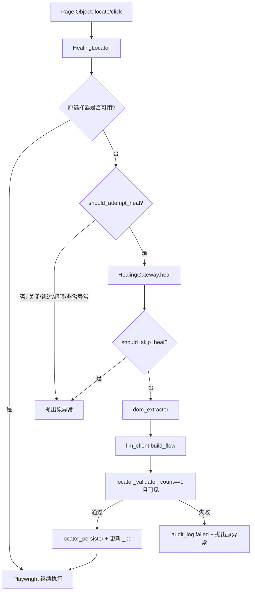
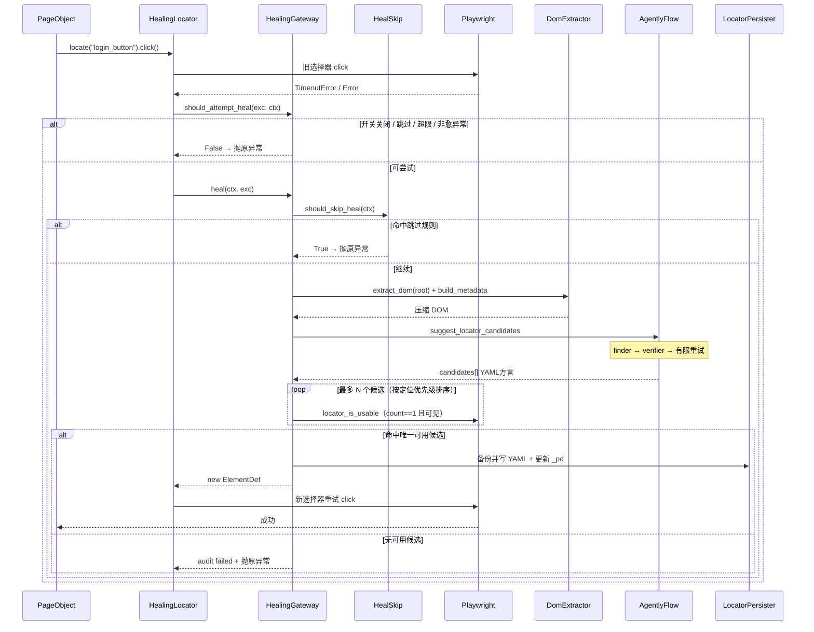

# UI 元素 AI 自愈

> 适用范围：`ui_pages` 中 Cloud 相关 Page Object 的元素定位  
> 更新日期：2026-08-10（与当前 `ui_healing/` 实现同步）

---

## 一、目标

当自动化运行到定位某个元素时：

1. **找到元素** → 继续执行，零额外开销
2. **未找到元素** → 捕获超时/未找到异常 →（可选）跳过规则过滤 → 将当前页面 DOM 发给 LLM → LLM 根据语义返回新选择器 → **Playwright 落地校验（须唯一命中）** → 重试执行 → **持久化到 `page_ele/` YAML**

自愈能力做在**定位基础设施层**，不逐文件散落 `try/catch`，`ui_pages` 只改调用方式，不改业务流程。

---

## 二、现状

| 层级 | 实现 | 说明 |
|------|------|------|
| **元素存储** | `page_ele/front/<域>/*.yml` | 自愈写回目标；支持纯字符串与结构化（`selector` / `semantic` / `locator_type` / `scope`） |
| **Page Object** | 继承 `CloudBasePage`，用 `locate` / `frame_locate` / `locate_on` | 替代 `page.locator(_pd["key"])`；动态 `get_by_text(业务文案)` 匹配本轮不迁 YAML |
| **引擎** | Playwright sync API | `HealingLocator` 包装常见操作；失败时自愈后重试一次 |
| **LLM** | Agently TriggerFlow（OpenAICompatible） | `llm.env` 配置；finder + verifier 双模型 |
| **跳过规则** | `heal_skip.yml` + `heal_skip.py` | 预期业务超时 / 限流文案等不调 LLM |
| **行为开关** | `configs/config.py` + `llm.env` + `CLOUD_HEALING_*` | 默认关闭；环境变量 / llm.env 覆盖 |

### 调用方式

```python
# 改前
self.page.locator(_pd["login_button"]).click()

# 改后
self.locate("login_button").click()

# iframe
self.frame_locate("card_number_iframe").locate("card_number_input").fill(card)
```

### YAML 示例

```yaml
login_button: '.login .login-button span'
login_password_input: '#password'
send_code_button: 'role=button[name="Send Code"]'

# 结构化（可选 semantic / scope）
card_number_input:
  selector: "input[name='cardNumber']"
  semantic: "卡号输入框"
  locator_type: css
  scope: card_number_iframe
```

---

## 三、模块结构

```
ui_healing/
├── __init__.py              # 导出 CloudBasePage / get_healing_gateway
├── cloud_base_page.py       # Page Object 基类：locate / frame_locate / expect_visible / pw_locator
├── healing_locator.py       # HealingLocator + FrameHealingContext
├── healing_gateway.py       # 编排：跳过规则 → DOM → LLM → 校验 → 持久化
├── healing_context.py       # 运行时上下文（cache_key / yaml_file）
├── heal_skip.py             # 加载 heal_skip.yml，判断是否跳过 LLM
├── heal_skip.yml            # 跳过元素键 / 页面文案模式
├── element_def.py           # YAML 元素解析、方言、定位优先级提示
├── locator_adapter.py       # YAML 方言 → Playwright Locator；locator_is_usable
├── locator_validator.py     # pick_valid_candidate（按优先级试候选）
├── locator_persister.py     # 写回 page_ele YAML（先备份）+ 更新 _pd
├── dom_extractor.py         # DOM 抓取、脱敏、压缩；build_metadata
├── llm_client.py            # Agently build_flow + suggest_locator_candidates
├── llm_config.py            # 加载 llm.env；连通性状态
├── audit_log.py             # JSONL 审计
├── config.py                # HealingConfig 聚合
├── llm.env / llm.env.example
configs/config.py            # HEALING_* 默认回落值
```



| 模块 | 职责 |
|------|------|
| `CloudBasePage` | 统一入口；业务 Page 继承 |
| `HealingLocator` | 在 click/fill/wait_for 等操作上失败时触发自愈后重试 |
| `HealingGateway` | 单次运行 LLM 次数上限、同 `cache_key` 只愈一次、编排全流程 |
| `heal_skip` | 配置化跳过：指定元素 / 页面可见文案命中时不调 LLM |
| `llm_client.build_flow` | Agently：finder 推选择器 → verifier 审核 → 最多重试 2 次 |
| `locator_adapter.locator_is_usable` | 落地硬门槛：`count() == 1` 且（默认）可见 |
| `ui_flows` / `strategies` | **无需改动** |

---

## 四、自愈执行流程



### LLM TriggerFlow（`build_flow`）

```
get_payload
  → find_and_check_new_selector
      → get_new_selector（finder：selector + locator_type + score）
      → check_new_selector（verifier：enable + reason）
      → 若 enable=false 且 retry_count≤2：再跑 finder + verifier（最多 2 次重试）
  → emit_candidates（审核通过则包装为 candidates[]，并 set_result）
```

对外同步入口：`suggest_locator_candidates(payload) -> List[dict]`。  
内部用 `asyncio` 跑 flow；若调用方已在事件循环中，则放到独立线程执行，避免嵌套 `asyncio.run`。

候选交给网关的形态：

```python
[{"selector": "...", "locator_type": "...", "confidence": 0.0~1.0, "reason": "agently score=..."}]
```

### 触发条件

`HealingGateway.should_attempt_heal` 同时满足：

1. `CLOUD_HEALING_ENABLED=1`（或 llm.env / configs 等价开启）
2. 未命中 `heal_skip`（在 `should_attempt_heal` 与 `heal` 入口均会检查）
3. 本轮 LLM 入口次数 `< CLOUD_HEALING_MAX_PER_RUN`
4. 异常类型属于：
   - Playwright `TimeoutError` / `Error`
   - Python `TimeoutError` / `AssertionError`（含 `expect(...).to_be_visible()`）

**不触发**：网络错误、跳转错误、文案断言不匹配等业务问题（异常类型不在上表）；或命中跳过规则。

### 跳过规则（`heal_skip.yml`）

定位器未必坏了，只是当前页面状态导致元素暂时不可见——此类失败不应调 LLM。

| 规则键 | 语义 |
|--------|------|
| `skip_elements` | `yaml相对路径/元素key` 或仅 `元素key`（后者对所有 YAML 生效，慎用） |
| `skip_when_page_text` | 页面 `body` 可见文案（忽略大小写）包含任一子串时跳过 |

当前示例：

- `front/login/login_signup_page.yml/verify_button`（发码频率限制未进验证码页）
- `front/login/login_signup_page.yml/send_code_button`（探测 2FA 超时属预期）
- 文案：`请求过于频繁` / `Too many requests` / `rate limit` 等

热更新测试可调用 `heal_skip.reload_skip_rules()`。

### 重试与去重策略

```
原选择器尝试 (1 次)
  → should_attempt_heal / should_skip_heal
  → Agently flow（同一 cache_key 每轮最多 1 次 LLM 入口；flow 内 verifier 失败可重试 finder≤2）
    → Playwright 候选校验（按 locator 类型优先级排序，最多 HEALING_MAX_CANDIDATES，默认 3）
      → 仍失败则抛原异常
```

`cache_key` 格式：`{yaml_file}::{parents|page}::{element_key}`  
（见 `HealingContext.cache_key`；iframe 链写入 `parent_keys`。）

进程内单例网关：`get_healing_gateway()`。批次/用例开始可调用 `reset_run()` 清空 LLM 计数与已愈缓存。

### 环境变量

| 变量 | 说明 | 默认 |
|------|------|------|
| `CLOUD_HEALING_ENABLED` | 开启自愈 | `0` |
| `CLOUD_HEALING_PERSIST` | 成功后写 YAML | `1` |
| `CLOUD_HEALING_MAX_PER_RUN` | 单次运行最大 LLM 入口次数 | `10` |
| `CLOUD_HEALING_API_TIMEOUT_S` | Agently flow 超时（秒） | `60` |
| `CLOUD_HEALING_DOM_MAX_CHARS` | DOM 截断长度 | `24000` |
| `CLOUD_HEALING_MAX_CANDIDATES` | Playwright 候选校验个数 | `3` |
| `CLOUD_HEALING_TESTCASE_ID` | 写入审计的用例 ID | 空 |
| `CLOUD_HEALING_LLM_ENV` | 指定 llm.env 路径 | `page_ele/ui_healing/llm.env` |
| `CLOUD_HEALING_API_KEY` / `API_BASE` / `MODEL` / `LLM_PROVIDER` | 覆盖 llm.env | — |
| `CLOUD_HEALING_FINDER_MODEL` | finder 模型 | `gpt-5.6-terra-medium` |
| `CLOUD_HEALING_VERIFIER_MODEL` | verifier 模型 | `gpt-5.6-luna-medium` |

配置合并顺序（`get_healing_config`）：

1. `llm_config.load_llm_env()`：把 `llm.env` 写入进程环境（**已存在的键不覆盖**）
2. 进程环境变量 `CLOUD_HEALING_*` / `REOLINK_RAG_LLM_*` 优先
3. `configs.config.HEALING_*` 作为开关与限额回落默认值

`llm.env` 主配置（与 `llm.env.example` 一致）：

- `REOLINK_RAG_LLM_API_KEY` / `REOLINK_RAG_LLM_API_BASE` / `REOLINK_RAG_LLM_MODEL`
- `CLOUD_HEALING_*` 行为开关与双模型名

依赖：`agently>=4.1`（建议 **Python ≥ 3.10**）。

---

## 五、DOM 与 LLM

### DOM（`dom_extractor`）

1. 按 `root`（Page / FrameLocator / Locator）取 HTML，失败回退 `page.content()`
2. 去 script/style/注释与部分噪声属性（`style` / `onclick` / `onload`）
3. 脱敏邮箱、卡号、token/password/secret/api_key
4. 超长则头尾截断（中间插入 `<!-- ... truncated ... -->`）

`build_metadata` 附带：`page_url` / `page_title` / `error_message`（截断）/ `viewport`。

### Prompt / 输出约定

- 角色：Playwright 测试专家（finder）+ UI 审计专家（verifier）
- 输入：元素键 + 语义 + 旧选择器 + locator_type + URL + 标题 + iframe 链 + 失败信息 + DOM
- **硬性唯一性**（finder 提示、verifier 规则、Playwright 落地三者一致）：
  - 选择器必须在页面上**只命中目标一个节点**（满足 Playwright strict mode）
  - 若 `placeholder` / `label` / `text` / `role` 等同文案在登录/注册等区域各出现一次，**禁止**用歧义语义定位，应改用唯一 id/CSS（如 `#password` 而非 `placeholder=Password`）
- **定位优先级**（`LOCATOR_PRIORITY_HINT` / `LOCATOR_TYPE_PRIORITY`；数字越小越优先）：
  1. `role`（优先带 accessible name）
  2. `text` / `label` / `placeholder` / `alt_text` / `title`
  3. `test_id`
  4. `css`（语义不唯一时优先唯一 id）
  5. `xpath`
- **输出必须是 YAML 方言**（不要 `page.get_by_*` JS API），例如 `role=button[name='Log in']`
- flow 最终交给网关的形态见上文；Playwright 侧再 `pick_valid_candidate`（按优先级排序后试 `locator_is_usable`）

### 选择器方言（`locator_adapter.to_playwright_locator`）

| 方言 | Playwright API |
|------|----------------|
| `role=button[name="..."]` | `get_by_role`（name 忽略大小写） |
| `text=...` | `get_by_text` |
| `label=...` | `get_by_label`（忽略大小写） |
| `placeholder=...` | `get_by_placeholder`（忽略大小写） |
| `alt=...` / `alt_text=...` | `get_by_alt_text` |
| `title=...` | `get_by_title` |
| `testid=...` / `test_id=...` | `get_by_test_id` |
| `xpath=...` | `locator("xpath=...")` |
| 其余 | CSS `locator` |

### 落地校验（`locator_is_usable`）

| 条件 | 要求 |
|------|------|
| 匹配数 | **`count() == 1`**（`0` 或 `>1` 均不可用） |
| 可见性 | 默认 `require_visible=True` 时该唯一节点须可见 |
| 异常 | 探测异常视为不可用 |

> 历史问题：曾用 `count()>0` + `.first.is_visible()`，导致 `placeholder=Password` 同时命中 `#password` 与 `#sign-up-password` 仍被落盘，随后 `fill` 触发 `strict mode violation`。现以 `count()==1` 作为硬门槛。

---

## 六、持久化与审计

1. **写回前备份**到 `data/healing_audit/yaml_backups/{stem}_{时间戳}.yml`
2. 文本补丁更新目标键（保留文件其它内容与注释；已有结构化块则只替换子字段）
3. 原子写：`.yml.tmp` → `yaml.safe_load` 校验 → rename
4. 同步更新内存 `_pd`（有 `semantic`/`scope` 时写结构化 dict，否则可写纯字符串）
5. `_commit_healed` **保留原 semantic/scope**，只替换 `selector` / `locator_type`
6. 审计：`data/healing_audit/healing_YYYYMMDD.jsonl`（`llm_model` 记 finder 模型名）

成功审计字段示例：`status` / `yaml` / `key` / `old` / `new` / `locator_type` / `url` / `testcase_id` / `llm_model` / `yaml_backup` / `timestamp`。  
失败审计：`status=failed` + `error`（截断）。

| 模式 | 行为 |
|------|------|
| **dev** | `ENABLED=1` + `PERSIST=1`，写 YAML |
| **ci** | `PERSIST=0`，只记审计，不污染仓库 |

---

## 七、Page Object 用法（实现约定）

```python
class CloudLoginPage(CloudBasePage):
    YAML_PARTS = ("front", "login", "login_signup_page.yml")
    _pd = load_page_yaml(*YAML_PARTS)

    def click_login(self):
        self.locate("login_button").click()

    def fill_card(self, number: str):
        self.frame_locate("card_number_iframe").locate("card_number_input").fill(number)
```

| API | 说明 |
|-----|------|
| `locate(key)` | 页面级自愈定位 |
| `locate_on(root, key, parent_keys=...)` | 在已有 root 上定位 |
| `frame_locate(iframe_key)` | iframe 链，可再 `frame_locator` 嵌套 |
| `expect_visible(key)` | 可见断言失败时同样可自愈后再断言一次 |
| `pw_locator(key)` | 原生 Locator（如 `expect_popup`），**不走**自愈包装 |

### HealingLocator 已包装操作

失败时可自愈后重试：`click` / `fill` / `type` / `press` / `check` / `uncheck` / `select_option` / `wait_for` / `scroll_into_view_if_needed` / `inner_text` / `text_content` / `is_visible` / `count` / `evaluate`。

辅助：`first` / `nth` / `raw`；`locator` / `filter` 返回原生 Locator（子定位不再包自愈）。未显式包装的属性经 `__getattr__` 转发到原生 Locator。

---

## 八、安全与稳定性

| 措施 | 说明 |
|------|------|
| LLM 双模型 | finder 推荐 + verifier 审核；审核失败有限重试 |
| 唯一性三道闸 | LLM 提示 / verifier 规则 / `locator_is_usable(count==1)` |
| 跳过规则 | 预期超时、限流文案等不调 LLM，避免误改选择器 |
| 单次自愈 | 同一 `cache_key` 每轮只调一次 LLM 入口 |
| 成本上限 | `MAX_PER_RUN` |
| 脱敏 | DOM 提取阶段 mask 邮箱/卡号/token |
| 失败兜底 | LLM/校验失败抛原始异常，不吞错 |
| YAML 备份 | 每次写回前备份 |
| 密钥 | 仅来自 `llm.env` / 环境变量，不进源码 |

---

## 九、启用方式

1. 配置 `page_ele/ui_healing/llm.env`（可参考 `llm.env.example`）

2. 开启（PowerShell；也可直接在 `llm.env` 写 `CLOUD_HEALING_ENABLED=1`）：

```powershell
$env:CLOUD_HEALING_ENABLED = "1"
$env:CLOUD_HEALING_PERSIST = "1"
```

3. 连通性自检（在 `official_website_server` 目录，`PYTHONPATH=.`，建议 Python ≥ 3.10）：

```powershell
py -3.10 -c "import json; from page_ele.ui_healing.llm_client import test_llm_connection; print(json.dumps(test_llm_connection(), ensure_ascii=False, indent=2))"
```

4. 按需维护 `heal_skip.yml`（预期失败元素 / 限流文案）  
5. 审计：`data/healing_audit/healing_YYYYMMDD.jsonl`  
6. YAML 备份：`data/healing_audit/yaml_backups/`

---

## 十、代码约定（可读性）

`ui_healing` 实现遵循 Cursor skill `readable-maintainable-code`：

| 约定 | 说明 |
|------|------|
| 禁止单行空壳 | 一行简单表达式不要单独成函数；`HealingLocator.click` 等属 Playwright 兼容对外 API，例外保留 |
| 嵌套宜浅 | 优先早返回；控制流尽量 ≤3 层；长流程拆同级私有方法（如 `heal` → `_build_llm_payload` / `_commit_healed`） |
| 方法注释 | 每个方法有简短 docstring，写用途或约束；禁止只复述函数名 |
| 对外稳定 | `CloudBasePage`、`get_healing_gateway`、`suggest_locator_candidates`、`test_llm_connection` 契约慎改 |

核心调用链：

```
CloudBasePage.locate(key)
  → HealingLocator.click/fill/...
    → 失败且 should_attempt_heal → HealingGateway.heal
      → should_skip_heal？→ DOM → suggest_locator_candidates(build_flow)
        → pick_valid_candidate（count==1）→ 更新 _pd /（可选）写 YAML → 重试
```

---

## 十一、待办

- [ ] CI 默认 `PERSIST=0` 的流水线约定落地
- [ ] 审计目录 gitignore 策略（建议忽略临时 DOM 快照，保留 jsonl 策略按团队定）
- [ ] 内联 `get_by_role` 等未迁 YAML 的定位器继续治理
- [ ] 用例/批次入口统一调用 `get_healing_gateway().reset_run()`（当前已提供 API，调用点待接线）
- [ ] finder 单次只返回一条候选时，歧义选择器被落地拒绝后无法自动回退到唯一 id——可考虑要求 LLM 返回多候选或二次提示

---

## 附录：相关路径

| 路径 | 说明 |
|------|------|
| `ui_healing/` | 自愈实现 |
| `ui_healing/heal_skip.yml` | 跳过自愈规则 |
| `configs/config.py` | `HEALING_*` 默认回落 |
| `page_ele/front/<域>/*.yml` | 元素 YAML（持久化目标；域：login/home/payment/dashboard/lock_card/payment_history） |
| `ui_pages/front/<域>/*.py` | Page Object |
| `page_ele/__init__.py` | `load_page_yaml()` |
| `README.md` | Cloud 模块整体说明 |
| `data/healing_audit/` | 审计与 YAML 备份 |
| `scripts/probe_login_pay_healing.py` | 登录支付路径自愈探活脚本 |
